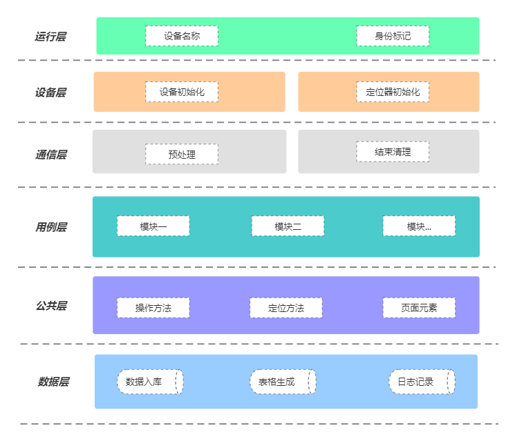

## 项目结构

```

├─air_test
│  ├─android    手游
│  │  ├─cases       测试脚本
│  │  │
│  │  ├─driver      设备通信
│  │  │
│  │  ├─logs        用例日志
│  │  ├─result      存放结果
│  │  ├─src
│  │  │  ├─case_data  驱动数据
│  │  ├─utils
│  │  │  ├─common     公共方法
│  │  │  │
│  │  │  ├─pages      页面元素
│  
│  
├─configs    项目配置
├─logs       项目日志
├─utils      项目公共方法
├─static     静态文件目录
├─air_settings.py   air_test设置
├─settings.py     项目配置
├─smoke_run.py     项目运行入口
```

## 项目架构



## 重点须知：

1.用例中的数据上报是针对后台服务，本地调试需要把数据上报注释掉（代码中已经注释掉）；

2.每条用例的编写处理，都需要有该条用例的测试结果：True:通过   False:失败，虽然不用上报，但是用例需要有;

3.每条用例的测试结尾都是以 BaseOperation.stop_teardown_test()处理，按照该方法对应的参数传参即可；

4.在编写测试用例时，如遇到不能获取到的控件元素，则以ocr方式进行判断关键字，已经封装好对应的公共方法，按参数传参使用即可；

5.每次编写测试用例之前，需要把src目录下的case_data驱动数据先填写，格式字段需与原来保持一致；

6.用例中的获取flow_id已经在公共操作方法内封装，如果里面不能满足自己的需求，可自己进行封装，注意的是：在获取flow_id的时候，需要考虑多场景，代码使用try: except处理；

7.公共配置项不能随意修改，否则会引起整个项目不能运行；

8.编写手游用例时，需要按照各自的目录进行存放，手游对应的是android;

9.case_data里面的驱动数据smoke.ini，可根据自己的需求进行修改里面的字段信息

10.调试以及运行用例的入口统一为smoke_run.py，在这里选择对应的手游或端游即可；

11.手游或端游在本地调试运行时，需要把android或windows目录下的 utils/common/basics.py  对应的case_file进行修改，本地运行需要把start_setup_test里面的case_file进行注释，然后把顶部的case_file打开
